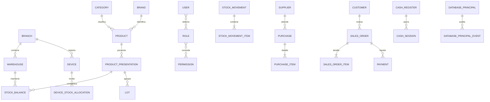

# Diagrama Entidad-Relación De Alto Nivel

```mermaid
erDiagram
    BRANCH ||--o{ WAREHOUSE : contiene
    BRANCH ||--o{ DEVICE : registra
    USER }o--o{ ROLE : obtiene
    ROLE }o--o{ PERMISSION : concede
    CATEGORY ||--o{ PRODUCT : clasifica
    BRAND ||--o{ PRODUCT : identifica
    PRODUCT ||--o{ PRODUCT_PRESENTATION : presenta
    WAREHOUSE ||--o{ STOCK_BALANCE : mantiene
    PRODUCT_PRESENTATION ||--o{ STOCK_BALANCE : contabiliza
    PRODUCT_PRESENTATION ||--o{ LOT : agrupa
    STOCK_MOVEMENT ||--|{ STOCK_MOVEMENT_ITEM : contiene
    SUPPLIER ||--o{ PURCHASE : atiende
    PURCHASE ||--|{ PURCHASE_ITEM : detalla
    CUSTOMER ||--o{ SALES_ORDER : realiza
    SALES_ORDER ||--|{ SALES_ORDER_ITEM : detalla
    SALES_ORDER ||--o{ PAYMENT : liquida
    CASH_REGISTER ||--o{ CASH_SESSION : opera
    DEVICE ||--o{ DEVICE_STOCK_ALLOCATION : recibe
    DATABASE_PRINCIPAL ||--o{ DATABASE_PRINCIPAL_EVENT : audita
```

El diagrama omite tablas auxiliares para conservar legibilidad. Las migraciones y el diccionario de datos son la fuente detallada.

